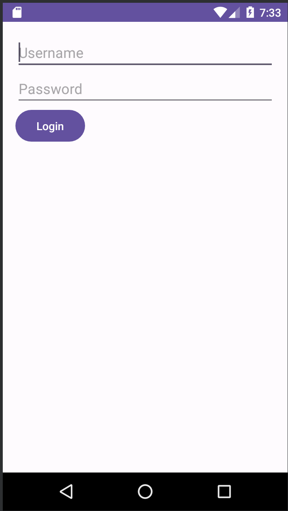
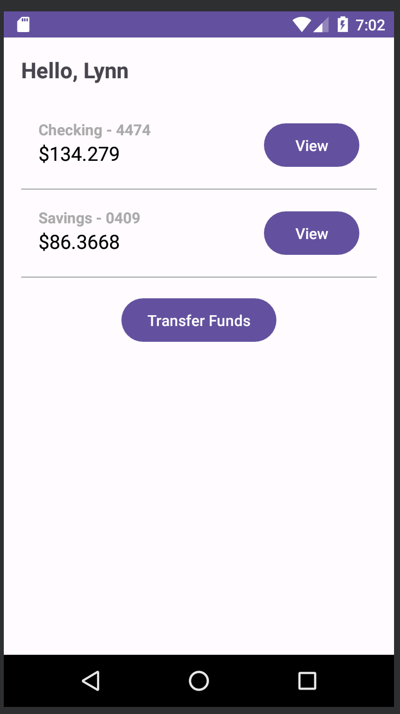
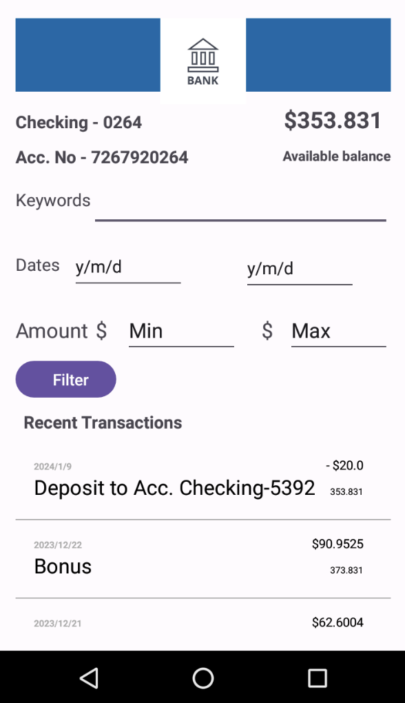
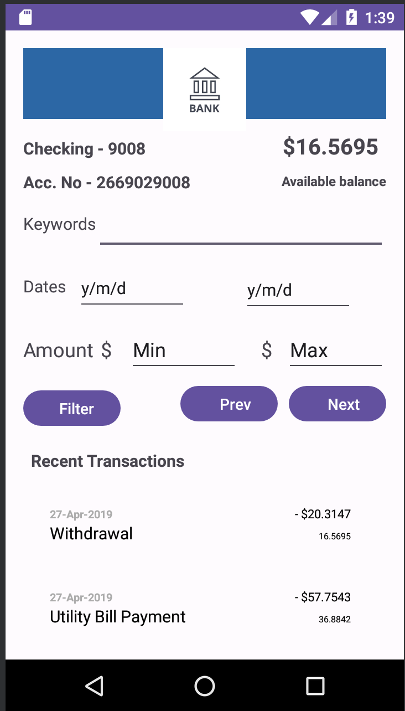
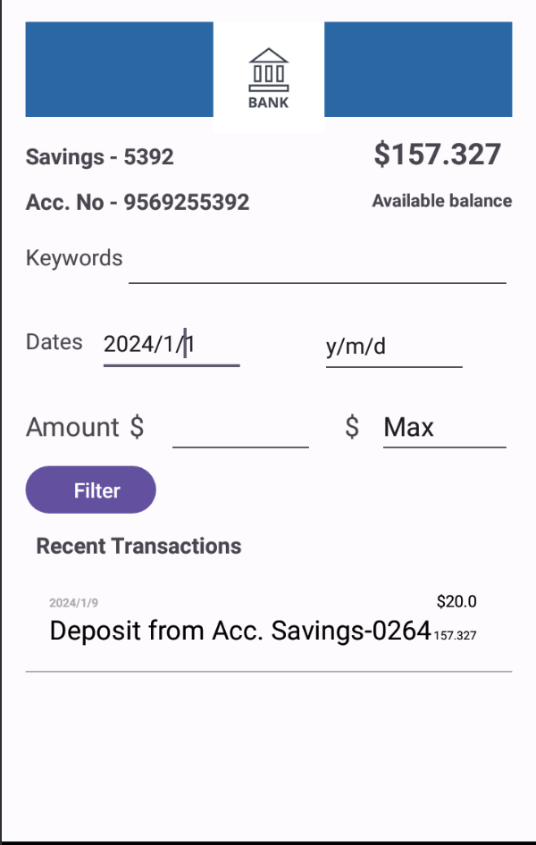
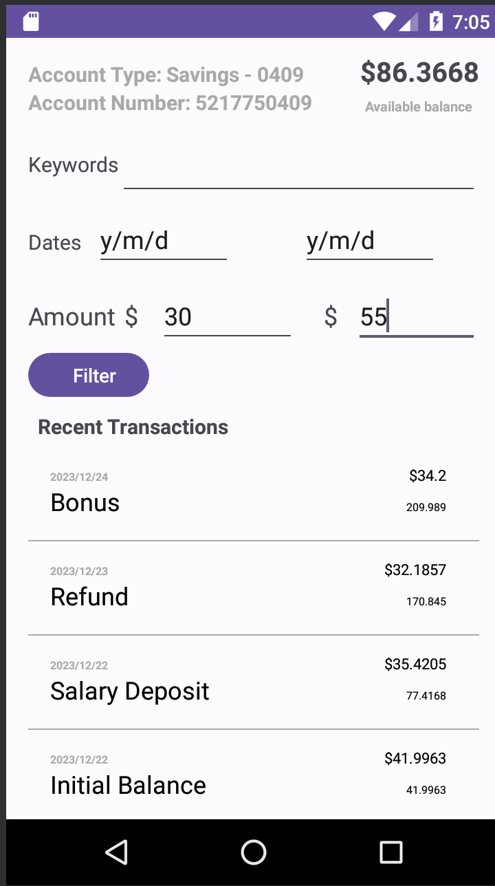
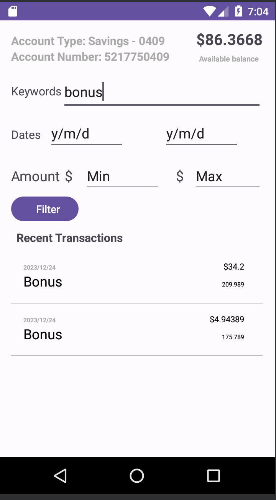
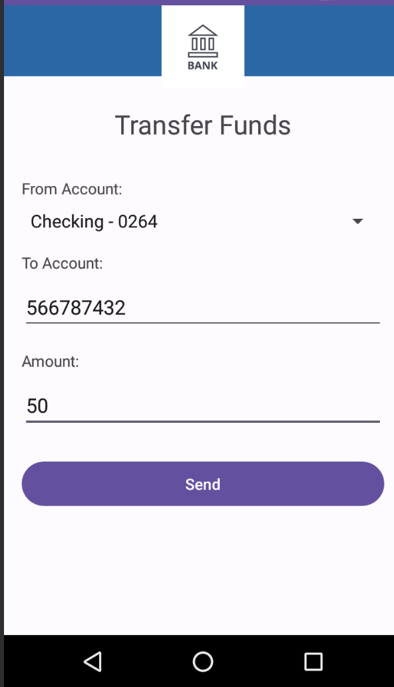

## Setup

1. Clone the repo flask-bank-backend https://github.com/anpa6841/flask-bank-backend and follow the  setup instructions

2. Launch Android Studio and register a device in the emulator for launching the app. 
   For e.g Android 7.1.1 ("Nougat") | arm64 for Mac M1.

3. In APIClient.java, replace API_SERVER with your flask server's ip address and port.
   
   e.g `https://<ip>:<port>`

   Note: Assign the private IP address instead of 127.0.0.1 as a workaround if Android Studio blocks
         traffic on localhost.

4. Default test user accounts created: [username:sa-1, password:sa-1], [username:sa-2, password:sa-2]

5. E2E Tests Repo: https://github.com/anpa6841/androidTests

Screenshots

### Login

### List Accounts

### List Transactions

### Paginated View

### Filter By Date

### Filter By Amount

### Filter By Keyword

### Transfer Funds

